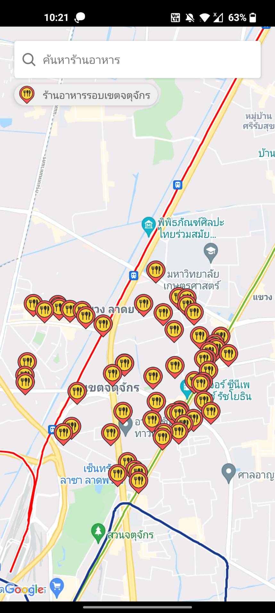
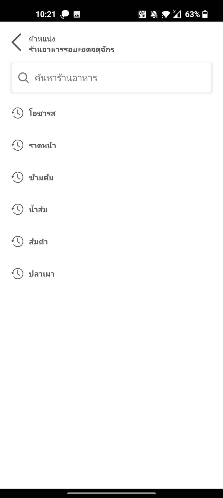
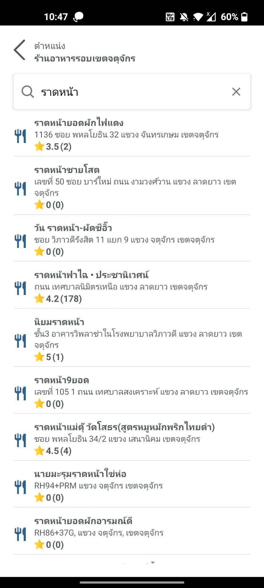

# react-native-quick-sample
find restaurants in Chatuchak area.

<p float="left">
  
  
  
</p>

## Demo for android (.APK file)
<a href="https://github.com/overpik/MapSearchTest/blob/master/app-release.apk">app-release.apk</a>

## Install and run on android
```
npm install -g react-native-cli
cd ProjectTest
npm install
react-native run-android
```

